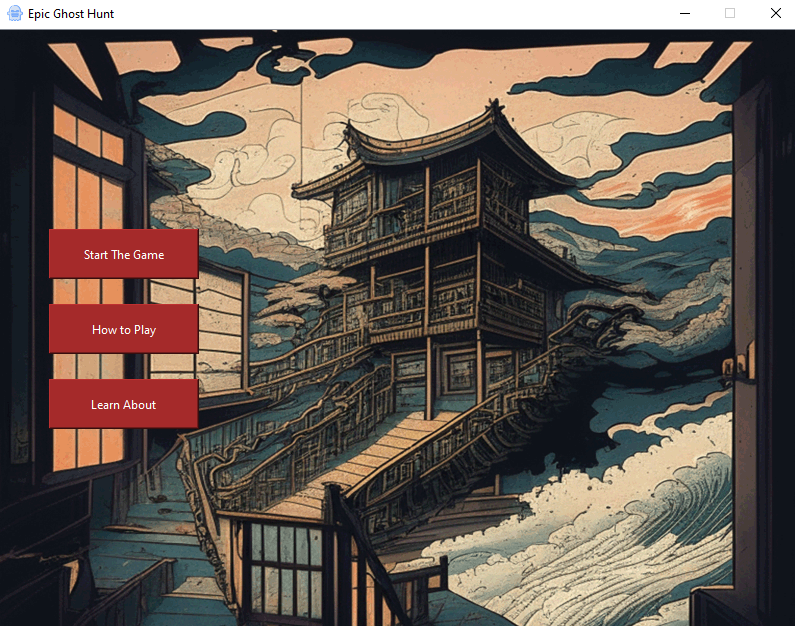
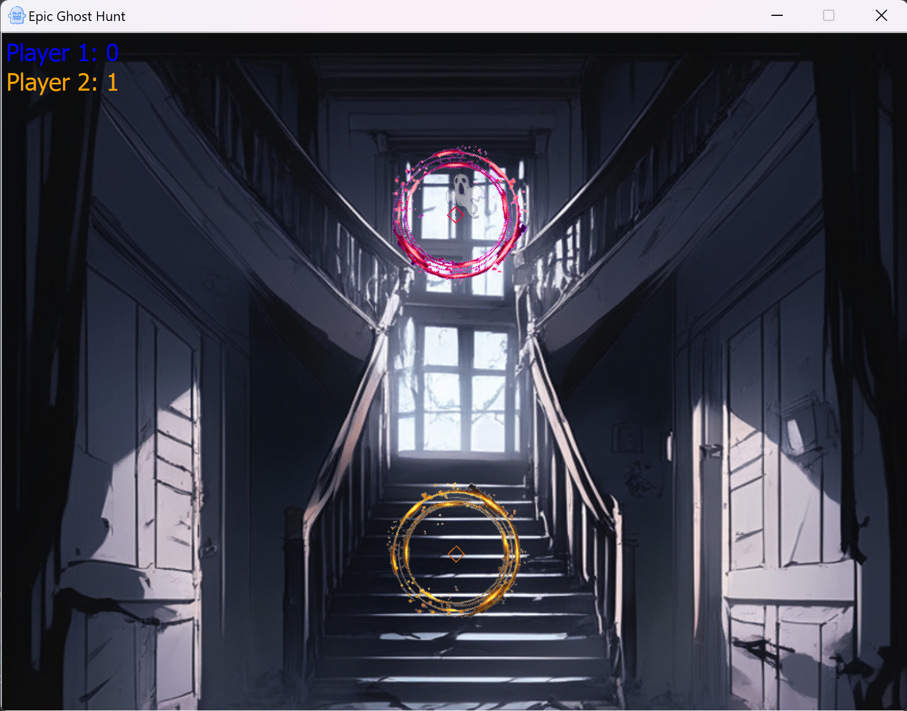
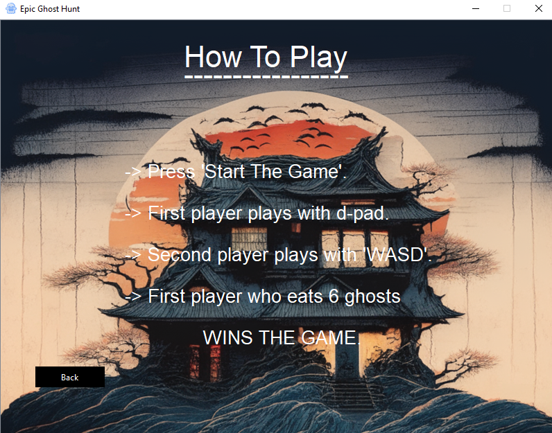

# Ghost Hunt

The implementation of this hide-and-seek game using C++ with a GUI provides an
engaging and entertaining gaming experience. By incorporating limited player vision, random
ghost movements, and a scoring system, the game promotes strategic thinking and
decision-making. The graphical user interface enhances the overall gameplay, making it
visually appealing and intuitive for players. The development of this hide-and-seek game
serves as an excellent demonstration of C++ programming skills, GUI implementation, and
game design principles.

### Images

| Main Menu                            | In Game                         | How to Play                                  
| ------------------------------------ | ------------------------------- | -------------------------------------- |
|  |  |  |
